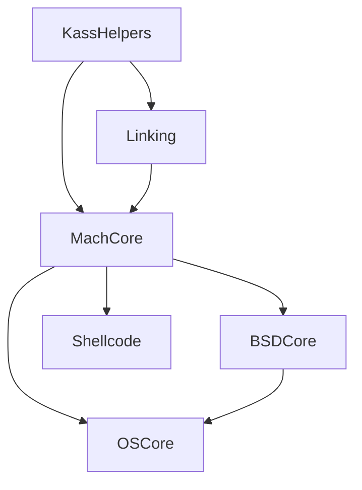

## Introduction

Kass is a collection of modules for reverse-engineering and security research on macOS, written in Swift. It focuses on interacting with the XNU kernel which underlies macOS, providing low-level access to Mach and BSD subsystems.

<Note>
These modules are designed primarily for reverse-engineering and security research. While they can be useful in production apps, that is not their intended purpose.
</Note>

## Core Modules

<CardGroup cols={2}>
  <Card title="MachCore" icon="gear" href="/modules/machcore">
    Interact with the Mach portion of the XNU kernel. Provides access to tasks, threads, ports, virtual memory, and messaging.
  </Card>
  
  <Card title="BSDCore" icon="terminal" href="/modules/bsdcore">
    Interact with the BSD portion of the XNU kernel. Provides system call wrappers, file system operations, and process management.
  </Card>
  
  <Card title="Linking" icon="link" href="/modules/linking">
    Dynamic library and symbol loading utilities using dlopen/dlsym. Access framework symbols and Objective-C classes.
  </Card>
  
  <Card title="Shellcode" icon="code" href="/modules/shellcode">
    Shellcode generation and injection utilities for ARM64. Inject code into running tasks and manage execution.
  </Card>
  
  <Card title="OSCore" icon="apple" href="/modules/oscore">
    OS-specific helpers including Darwin notification system (Libnotify) and IOKit interfaces.
  </Card>
</CardGroup>

## Module Dependencies

Based on `Package.swift`, the dependency hierarchy is:



- **KassHelpers**: Internal utilities used across all modules
- **Linking**: Standalone dynamic linking utilities
- **MachCore**: Foundation for Mach kernel interaction
- **BSDCore**: Depends on MachCore for task and process operations
- **Shellcode**: Depends on MachCore for memory and thread operations
- **OSCore**: Depends on both MachCore and BSDCore

## Platform Support

- **macOS**: 10.13+ (primary target)
- **iOS**: 12.0+ (limited testing)
- **Architecture**: ARM64 (shellcode), x86_64 (limited)

<Warning>
This library is thoroughly tested only on the latest version of macOS. Older API versions may be included but should be considered untested.
</Warning>

## Common Patterns

### Error Handling

All modules use Swift's native error handling with typed errors:

<CodeGroup>
```swift Mach Errors
import MachCore

do {
    try Mach.call(mach_task_self())
} catch let error as MachError {
    print("Mach error: \(error)")
}
```

```swift BSD Errors
import BSDCore

do {
    try BSD.call(some_posix_function())
} catch let error as POSIXError {
    print("POSIX error: \(error)")
}
```
</CodeGroup>

### Namespace Pattern

Modules use namespace structs to organize functionality:

```swift
// Mach operations under Mach namespace
let task = Mach.Task.current
let threads = try task.threads

// BSD operations under BSD namespace
try BSD.syscall(SYS_getpid)

// OS operations under OS namespace
let notification = OS.Notify.NotificationName("com.example.event")
```

## Next Steps

<CardGroup cols={2}>
  <Card title="MachCore Guide" icon="book" href="/modules/machcore">
    Learn about task management, ports, and virtual memory
  </Card>
  
  <Card title="BSDCore Guide" icon="book" href="/modules/bsdcore">
    Explore system calls and BSD kernel features
  </Card>
</CardGroup>
